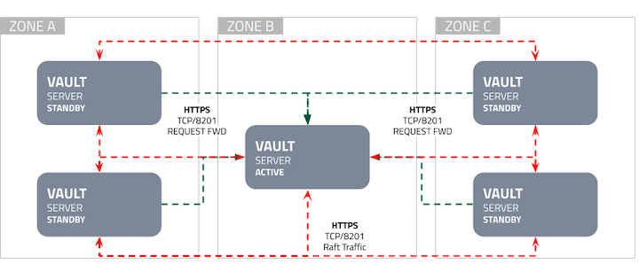
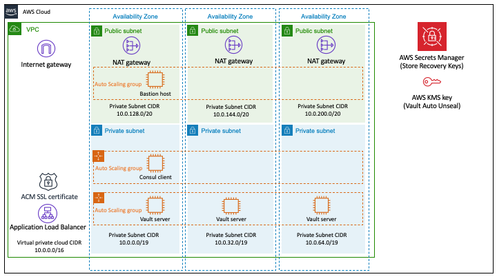

## HashiCorp Vault on the AWS Cloud

### Table of Contents
- [Overview](#overview)
- [Vault Storage Architectture](#vault-storage-architectture)
- [QuickStart Architectture](#quickstart-architectture)
- [Getting Started](#getting-started)
- [Documentation](#documentation)
- [Contributing](#contributing)
- [Support](#support)
- [License](#license)

### Overview
This repo contains a set of CloudFormation templates and modules for deploying an open-source HashiCorp Vault cluster and clients on AWS. HashiCorp Vault is a tool that provides secrets management, encryption as a service, and privileged access management. Vault’s core use cases include:

* Secrets Management, to centrally store, access, and distribute dynamics seecrets;
* Data Protection, to keep data secure with centralized key management and simple APIs for data encryption.

### Vault Storage Architectture

The following table outlines the network traffic requirements for Vault cluster nodes.

| Source        | Destination   | port | protocol | Direction     | Purpose                                       |
| ------------- | ------------- | ---- | -------- | ------------- | --------------------------------------------- |
| Vault clients | Vault servers | 8200 | tcp      | incoming      | Vault API                                     |
| Vault servers | Vault servers | 8201 | tcp      | bidirectional | Vault replication traffic, request forwarding |
| Vault servers | Vault servers | 8200 | tcp      | bidirectional | Raft gossip traffic                           |

### QuickStart Architectture

Deployed Versions:
* `VAULT AGENT VERSION`='1.4.0'
* `VAULT SERVER VERSION`='1.4.0'

For architectural details, best practices, step-by-step instructions, and customization options, see the [deployment guide](https://aws-quickstart.s3.amazonaws.com/quickstart-hashicorp-vault/doc/hashicorp-vault-on-the-aws-cloud.pdf).

### Getting Started
#### How to Use this Repo
This repo has the following folder structure:
* [templates](https://github.com/aws-quickstart/quickstart-hashicorp-vault/tree/master/templates): CloudFormation templates to deploy the QuickStart stacks.
* [submodules](https://github.com/aws-quickstart/quickstart-hashicorp-vault/tree/master/submodules): Git submodules utilized during the deployment of QuickStart stacks.
* [ci](https://github.com/aws-quickstart/quickstart-hashicorp-vault/tree/master/ci): Utilized by [taskcat](https://github.com/aws-quickstart/taskcat) utility to run tests via CI.
* [functions](https://github.com/aws-quickstart/quickstart-hashicorp-vault/tree/master/functions): Contains packaged functions used by the QuickStart templates during deployment.
* [scripts](https://github.com/aws-quickstart/quickstart-hashicorp-vault/tree/master/functions): Contains bootstrap scripts for vault server and client nodes deployed in the QuickStart stacks.
* [images](https://github.com/aws-quickstart/quickstart-hashicorp-vault/tree/master/images): Images of the QuickStart and Vault Storage Architecture.

#### How to Deploy Vault QuickStart Templates
To deploy a Vault cluster and clients using this repo, there are two approaches:
* End-to-end Deployment: deploys HashiCorp Vault cluster and its ELB, Vault clients, and a bastion host into a new VPC with public, private subnets, and gateways. See [master deployment template](https://github.com/aws-quickstart/quickstart-hashicorp-vault/tree/master/templates/quickstart-hashicorp-vault-master.template).
* Existing Infrastructure Deployment: deploys HashiCorp Vault cluster and its ALB, Vault clients, and a bastion host into a an existing VPC and its associated public, private subnets, and gateways. See [vault deployment template](https://github.com/aws-quickstart/quickstart-hashicorp-Vault/tree/master/templates/quickstart-hashicorp-vault.template).

#### How to Deploy Vault with Raft Integrated Storage
[Raft](https://www.vaultproject.io/docs/internals/integrated-storage) consensus algorithm is enabled by default. Using raft as a storage backend eliminates reliance on any third party systems, it implements high availability, supports Enterprise Replication features, and provides backup/restore workflows. For more information, please visit the following HashiCorp Learn pages:
* [Vault with Integrated Storage Reference Architecture](https://learn.hashicorp.com/vault/operations/raft-reference-architecture)
* [Vault HA Cluster with Integrated Storage on AWS](https://learn.hashicorp.com/vault/operations/raft-storage-aws)
* [Migrating to Integrated Storage](https://learn.hashicorp.com/vault/operations/storage-migration-checklist)

#### How to Manage Vault Agent with AWS Auth Method
[AWS auth method](https://www.vaultproject.io/docs/auth/aws) is available an optional auth method in the deployment wizard. The aws auth method provides an automated mechanism to retrieve a Vault token for IAM principals and AWS EC2 instances. For more information, please visit [Vault Agent with AWS](https://learn.hashicorp.com/vault/identity-access-management/vault-agent-aws).

#### How to Manage Vault Agent with Kubernetes Auth Method
[Kubernetes auth method](https://www.vaultproject.io/docs/auth/kubernetes) is available an optional auth method in the deployment wizard. The kubernetes auth method can be used to authenticate with Vault using a Kubernetes Service Account Token. For more information, please visit [Vault Agent with Kubernetes](https://learn.hashicorp.com/vault/identity-access-management/vault-agent-k8s).

#### How to Manage Vault Auto Unseal with AWS KMS
[Vault auto unseal](https://www.vaultproject.io/docs/concepts/seal#auto-unseal) was developed to aid in reducing the operational complexity of keeping the master key secure. For more information, please visit [Auto Unseal using AWS KMS](https://learn.hashicorp.com/vault/operations/ops-autounseal-aws-kms).

### Documentation
Vault provides several key features:

* **Secure Secret Storage** - Arbitrary key/value secrets can be stored in Vault. Vault encrypts these secrets prior to writing them to persistent storage, so gaining access to the raw storage isn't enough to access your secrets. Vault can write to disk, S3, and more.

* **Dynamic Secrets** - Vault can generate secrets on-demand for some systems, such as AWS or SQL databases. For example, when an application needs to access an S3 bucket, it asks Vault for credentials, and Vault will generate an AWS keypair with valid permissions on demand. After creating these dynamic secrets, Vault will also automatically revoke them after the lease is up.

* **Data Encryption** - Vault can encrypt and decrypt data without storing it. This allows security teams to define encryption parameters and developers to store encrypted data in a location such as SQL without having to design their own encryption methods.

* **Leasing and Renewal** - All secrets in Vault have a lease associated with it. At the end of the lease, Vault will automatically revoke that secret. Clients are able to renew leases via built-in renew APIs.

* **Revocation** - Vault has built-in support for secret revocation. Vault can revoke not only single secrets, but a tree of secrets, for example all secrets read by a specific user, or all secrets of a particular type. Revocation assists in key rolling as well as locking down systems in the case of an intrusion.

Full, comprehensive documentation is viewable on the [Vault docs pages](https://www.vaultproject.io/docs).

### Contributing
Thank you for your interest in contributing! Please refer to [Quick Start Contributor's Guide](https://aws-quickstart.github.io) for instructions.

### Support
- HashiCorp Support: https://support.hashicorp.com
- AWS QuickStart Support: https://aws.amazon.com/quickstart

### License

